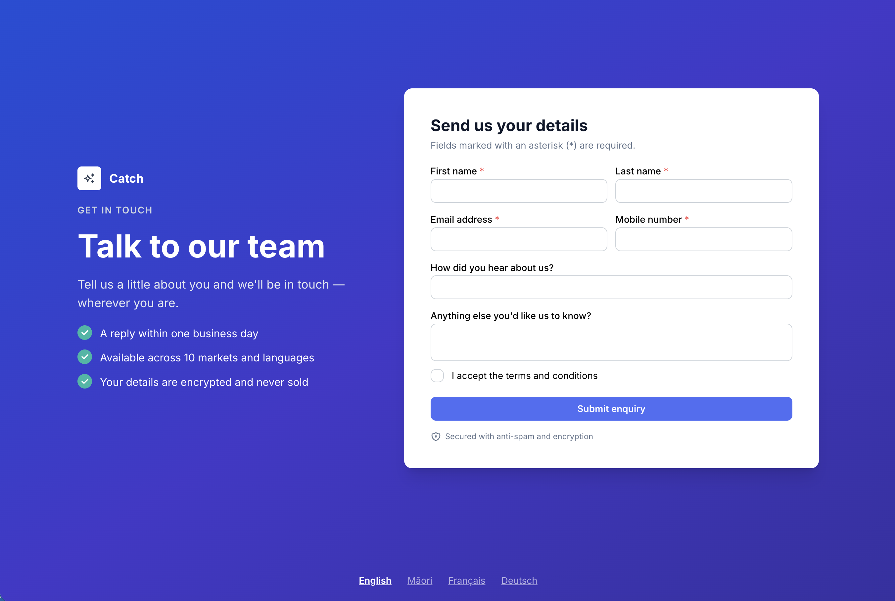

# Global Leads Platform — Technical Lead Test



Phase 1 reference implementation: a responsive, multilingual website with an
accessible **lead capture form** and a server-side **lead handler** that validates,
sanitises, stores, and routes leads by type + country of origin.

This repo contains both the **written deliverables** (`docs/`) and a **working
project** (a Next.js app demonstrating the proposed stack).

> The original brief is in [`TASK.md`](TASK.md).

```
.
├── README.md
├── TASK.md                 # Original brief
├── docs/
│   ├── _assets/            # Mermaid sources for the diagrams
│   ├── 1-solution.md       # Architecture, tech, plain-English summary, threat model
│   └── 2-delivery-estimate-and-timeline.md
├── src/
│   ├── app/
│   │   ├── [locale]/       # Localised pages (en, mi, fr, de) + SEO/social meta + JSON-LD
│   │   ├── api/leads/      # Lead capture route + helpers/ (sanitise, store,
│   │   │                   #   route, deliver, geo, anti-spam, rate-limit)
│   │   └── globals.css
│   ├── components/         # Landing, LanguageSwitcher, LeadCaptureForm/
│   ├── i18n/               # next-intl routing/config/navigation
│   ├── lib/                # leadSchema — Zod contract shared client/server/mobile
│   ├── theme.ts            # Mantine theme
│   └── middleware.ts       # Locale negotiation
├── messages/               # Translation catalogues per locale
├── tests/                  # Vitest unit tests
└── data/                   # Local lead store (JSONL, git-ignored)
```

## Tech stack

| Concern        | Choice                                                                               |
| -------------- | ------------------------------------------------------------------------------------ |
| Framework      | Next.js 14 (App Router) + React 18 + TypeScript                                      |
| i18n           | next-intl (locale-prefixed routing, 10-market ready)                                 |
| Forms          | React Hook Form + Zod (one schema shared client/server — and Phase 2 mobile)         |
| Sanitisation   | isomorphic-dompurify                                                                 |
| Anti-spam      | Cloudflare Turnstile (client widget + server verify) + per-IP rate limit             |
| Storage (demo) | File JSON-Lines store behind a `LeadStore` interface (prod → region-pinned Postgres) |
| Tests          | Vitest                                                                               |
| Lint/format    | ESLint (next/core-web-vitals) + Prettier                                             |

See [`docs/1-solution.md`](docs/1-solution.md) for the full rationale.

## Prerequisites

- Node.js **>= 18.18** (developed on Node 22)
- npm

## Setup

```bash
npm install
cp .env.example .env.local   # optional — demo runs without any secrets
```

All secrets are optional for local dev. With no keys:

- **Turnstile** — the widget is not rendered and the server skips the challenge
  **in development** (`npm run dev`); the per-IP rate limit still applies. In
  **production** (`npm run build && npm start`) a missing `TURNSTILE_SECRET_KEY`
  **fails closed** (every submit → `403`), so configure Turnstile before deploying.
  Cloudflare provides always-pass/always-fail test keys for local testing.
- **Email / CRM** — delivery is simulated (logged, marked delivered).

## Run

```bash
npm run dev
```

Open <http://localhost:3100/en> (also `/mi`, `/fr`, `/de`). The root `/` redirects
to a negotiated locale. (Server runs on port **3100** — set in the `dev`/`start` scripts.)

> **Locales:** `en`, `mi`, `fr`, `de` ship as a **representative subset** of the
> brief's 10 markets. Adding a market is config-driven — one entry in
> `src/i18n/routing.ts` plus a `messages/<locale>.json` file.

## Try the lead handler

Submit the form in the browser, or hit the API directly:

```bash
curl -i -X POST http://localhost:3100/api/leads \
  -H 'content-type: application/json' \
  -d '{
    "firstName":"Ada","lastName":"Lovelace",
    "email":"ada@example.com","mobile":"+64 21 555 0000",
    "acceptTerms":true,"marketingReferral":"Google",
    "notes":"Keen to hear more","turnstileToken":""
  }'
```

(Run against `npm run dev` so the Turnstile challenge is skipped; under `npm start`
without keys this returns `403` by design — see the secrets note above.)

A successful call returns `202 Accepted` with the lead id, and the record is appended
to `data/leads.jsonl`. The handler:

1. **Rate-limits** per IP and **verifies the Turnstile token** (anti-spam).
2. **Validates** the payload against the shared Zod schema.
3. **Sanitises** every free-text field (strips HTML/scripts/control chars).
4. **Persists** the lead as `pending` _before_ delivery (so nothing is lost on failure).
5. **Routes** it by **server-derived country** (geo-IP) to email and/or a 3rd-party
   CRM API, then marks it `delivered` or `failed` (failed → retried / replayable).

## Scripts

| Script                        | Purpose                  |
| ----------------------------- | ------------------------ |
| `npm run dev`                 | Start the dev server     |
| `npm run build` / `npm start` | Production build / serve |
| `npm test`                    | Run unit tests (Vitest)  |
| `npm run test:coverage`       | Tests with coverage      |
| `npm run typecheck`           | TypeScript, no emit      |
| `npm run lint`                | ESLint                   |
| `npm run format`              | Prettier write           |

## Accessibility & SEO notes

- Semantic labels, `aria-invalid`/`aria-describedby` error wiring, visible focus
  rings, a skip link, and `role="alert"`/`role="status"` live regions on the form.
- Per-locale `lang`, canonical + `hreflang` alternates, OpenGraph/Twitter meta, and
  schema.org **JSON-LD** structured data emitted from the layout.

## Demo simplifications & production assumptions

This is a focused reference for the test, not the full platform. Each simplification
below sits behind a clean seam (`LeadStore`, `DeliveryAdapter`, the geo/rate-limit
helpers) so production wiring is a swap, not a rewrite. Full design in
[`docs/1-solution.md`](docs/1-solution.md).

| Concern             | Demo (here)                                                                        | Production assumption                                                                                                           |
| ------------------- | ---------------------------------------------------------------------------------- | ------------------------------------------------------------------------------------------------------------------------------- |
| **Lead storage**    | Appends to a local JSONL file on disk (`data/leads.jsonl`)                         | **No disk writes.** Region-pinned, encrypted Postgres/RDS per the lead's jurisdiction (data residency)                          |
| **Rate limiting**   | In-memory map, per-process (resets on restart, not shared across instances)        | Enforced at the **edge / WAF** and/or a shared **Redis** (e.g. Upstash) so limits hold across horizontally-scaled instances     |
| **Client IP**       | Reads `x-forwarded-for` (spoofable, app-tier)                                      | Trust the **edge's** verified header — Cloudflare `cf-connecting-ip` (or `x-vercel-forwarded-for`) — not arbitrary client input |
| **Country / geo**   | `x-vercel-ip-country` / `cf-ipcountry`, falls back to `NZ`                         | Same edge geo-IP headers, guaranteed present + trusted at the CDN/WAF boundary                                                  |
| **Anti-spam**       | Turnstile skipped in dev (fails closed in prod); no WAF                            | **Cloudflare Turnstile** keys configured + **WAF bot rules / DDoS** at the edge                                                 |
| **Delivery**        | Adapters run **inline** in the request, email/CRM calls simulated when keys absent | Enqueued on a **durable queue (SQS / Cloud Tasks)** with retry + **dead-letter queue**, processed by a worker                   |
| **CMS & live feed** | Not wired (content is static)                                                      | Headless CMS (Sanity/Contentful) + server-proxied 3rd-party feed with caching/revalidation                                      |
| **Observability**   | `console.error` only                                                               | OpenTelemetry logs/metrics/traces → Datadog/Grafana + Sentry, SLO-based alerting                                                |
| **Secrets**         | `.env.local`                                                                       | Managed secret store / KMS                                                                                                      |
