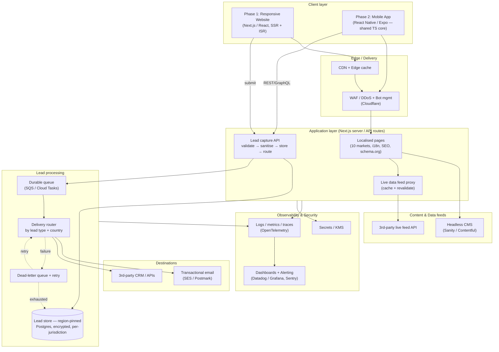

# 1. Solution — High-Level Architecture

## 1.1 System component diagram

> Rendered inline below (GitHub renders Mermaid). The diagram source is also in
> [`_assets/hla.mmd`](./_assets/hla.mmd).

## 1.2 Architecture & technology choices

**Frontend / framework.** Phase 1 is a **Next.js (React + TypeScript)** application
rendered server-side (SSR) with incremental static regeneration (ISR). This choice
is driven directly by the brief's non-functional requirements: server rendering
gives crawlable HTML and fast first paint for **Lighthouse SEO + Performance**;
React's mature ecosystem and component model make **WCAG 2.2 AA** achievable with
semantic markup, managed focus and ARIA; and Next's built-in **internationalised
routing** (`next-intl`) covers **10 markets with multilingual content**, locale-prefixed
URLs, and `hreflang`/canonical tags. Structured **schema.org JSON-LD** and **OpenGraph/Twitter
social meta** are emitted per page from the same metadata layer. This is the key
lever for **Phase 2**: the mobile app is built in **React Native (Expo)**, reusing the
same TypeScript language, validation schemas (a single shared Zod contract), API
client and design tokens — so the "base technology stack" genuinely carries across
web and mobile rather than being rebuilt.

**Content.** A **headless CMS** (Sanity or Contentful) lets non-technical authors
manage multilingual content and localise per market without deploys. Content is
pulled at build/ISR time and cached at the edge; webhooks trigger revalidation on
publish. The **live 3rd-party data feed** is never called directly from the browser —
it is proxied through a server route that caches and revalidates on a short TTL,
which protects the upstream, hides credentials, and keeps the page fast and resilient
if the feed is slow or down.

**Lead capture & routing.** The form posts to a server API that runs a strict pipeline:
**validate (Zod) → sanitise (strip HTML/scripts/control chars) → persist → route**.
The lead is **written to durable storage _before_ any delivery is attempted**, which is
what satisfies "leads must be stored in case of delivery failure". Delivery is then
performed via a **durable queue with retry and a dead-letter queue**; a declarative
**routing table keyed by lead type + country of origin** decides whether each lead
goes to **transactional email**, a **3rd-party CRM/API**, or both. Failed deliveries
retry with backoff and, if exhausted, remain flagged in storage for manual replay —
no lead is ever silently lost.

**Data residency & privacy.** Because audiences span 10 countries with differing
privacy laws (GDPR, NZ/AU Privacy Acts, etc.), the lead store is **region-pinned**:
PII is written to a database in (or appropriate to) the lead's own jurisdiction,
**encrypted at rest (KMS)** and in transit, with **retention/erasure policies** and
consent (`acceptTerms`) captured and timestamped on the record. The storage layer is
behind an interface so the demo's file store and production's regional Postgres are
interchangeable.

**Security & anti-spam.** Defence in depth: a **WAF + bot management/DDoS** layer at the
edge, **CAPTCHA (Cloudflare Turnstile)** plus a **honeypot field** and **per-IP rate
limiting** on the form, strict **input validation + sanitisation**, a strict
**Content-Security-Policy** and security headers (HSTS, X-Content-Type-Options,
frame-deny), and secrets held in a managed store/KMS — never in the client.

**Observability.** The system emits **structured logs, metrics and distributed traces**
via **OpenTelemetry** to a backend such as **Datadog/Grafana**, with **Sentry** for error
tracking. Alerting is tied to **SLOs** — submission error rate, delivery-failure/DLQ
depth, feed-proxy latency, and Core Web Vitals regressions — routed to on-call via
PagerDuty/Slack so problems surface before users report them.

**Mobile accessibility (Phase 2).** The React Native app uses the platform
accessibility APIs (iOS VoiceOver / Android TalkBack) through RN's `accessibilityLabel`,
`accessibilityRole` and traits, respects OS-level dynamic font sizing and
reduce-motion, and inherits the same validated, accessible form logic from the shared core.

**Hosting.** Next.js runs on **Vercel** (or AWS via container/SST) at the edge for the
web tier, with **regional managed Postgres + queue** for data that must stay in-region.
This keeps the global front-end fast while pinning regulated data appropriately.

## 1.3 Explanation for a non-technical audience

Think of the platform as a **multilingual shopfront with a smart reception desk.**

- The **shopfront (website)** is built once and automatically shows the right
  language and content for each of the 10 countries. It's designed to load fast, work
  for people using screen readers or keyboards, and rank well on Google.
- Marketers update the words and images themselves through a **content system (CMS)**,
  like editing a document — no developer or release needed.
- Some content is **live information pulled from another company's system**; we fetch it
  safely in the background and keep a recent copy so our pages stay fast even if that
  other system is slow.
- When a visitor fills in the **enquiry form**, the "reception desk" checks the details,
  cleans them, and **writes them down safely first**. Only then does it pass the enquiry
  to the right place — an **email inbox or a partner system** — chosen by the type of
  enquiry and the country it came from. If a hand-off fails, we already have the
  enquiry saved and we keep retrying, so **no lead is ever lost.**
- Personal details are **stored in the right country and locked away (encrypted)** to
  meet each region's privacy laws.
- We keep out **spam and bots**, and we have **alarms and dashboards** that tell our team
  immediately if anything breaks.
- Later, the **mobile app (Phase 2)** reuses the same engine, so it's faster and cheaper
  to build and behaves consistently with the website.

## 1.4 Risks & initial threat model

### Delivery / technical risks

| Risk                                                | Impact                              | Mitigation                                                                              |
| --------------------------------------------------- | ----------------------------------- | --------------------------------------------------------------------------------------- |
| 3rd-party feed or CRM outage / rate limits          | Broken pages or lost lead delivery  | Server-side caching + stale-while-revalidate; queue with retry + DLQ; store-before-send |
| Lost leads on delivery failure                      | Lost revenue, no audit trail        | Persist before delivery; DLQ + manual replay; alert on DLQ depth                        |
| Data residency / privacy non-compliance (GDPR etc.) | Legal/financial penalty             | Region-pinned storage, encryption, retention/erasure, consent capture, DPIA per market  |
| Accessibility regressions over time                 | WCAG 2.2 AA failure, legal exposure | Automated axe checks + Lighthouse CI in the pipeline + periodic manual audit            |
| Translation/localisation gaps                       | Poor UX in some markets             | CMS-managed localisation, fallback locale, professional translation workflow            |
| Scope creep across 10 markets                       | Timeline/budget overrun             | Config-driven markets; per-market launch waves                                          |

### Security threat model (STRIDE, abridged)

| Threat                     | Example                         | Control                                                                               |
| -------------------------- | ------------------------------- | ------------------------------------------------------------------------------------- |
| **Spoofing**               | Bots/fake submissions           | Turnstile CAPTCHA, honeypot, rate limiting, WAF bot rules                             |
| **Tampering**              | XSS / injection via form fields | Strict Zod validation + HTML/script sanitisation, parameterised queries, CSP          |
| **Repudiation**            | "I never consented"             | Timestamped consent + audit log on each lead record                                   |
| **Information disclosure** | PII leak, secrets in client     | Encryption at rest/in transit, secrets in KMS, least-privilege access, no PII in logs |
| **Denial of service**      | Form flooding, feed hammering   | Edge DDoS protection, rate limits, cached feed proxy                                  |
| **Elevation of privilege** | CMS/admin compromise            | SSO + MFA, RBAC, audited access, environment isolation                                |

**Top initial threats to track:** automated spam/abuse of the public form;
cross-border PII handling compliance; and dependency on external systems (feed + CRM)
whose availability we don't control. All three are addressed in the design above and
should be re-reviewed at each market launch.
