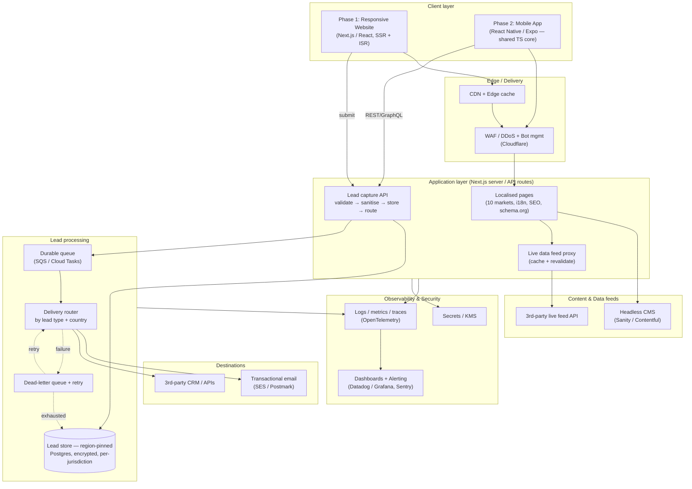

# 1. Solution — High-Level Architecture

## 1.1 System component diagram

> Rendered inline below (GitHub renders Mermaid). The diagram source is also in
> [`_assets/hla.mmd`](./_assets/hla.mmd).

## 1.2 Architecture & technology choices

### Frontend / framework — Next.js (React + TypeScript), SSR + ISR

- **Why SSR/ISR:** crawlable HTML + fast first paint → meets **Lighthouse SEO + Performance**.
- **Accessibility:** React's component model makes **WCAG 2.2 AA** achievable (semantic markup, managed focus, ARIA).
- **i18n:** `next-intl` covers **10 markets**, locale-prefixed URLs, `hreflang` + canonical tags.
- **SEO/social:** **schema.org JSON-LD** + **OpenGraph/Twitter** meta emitted per page from one metadata layer.
- **Phase 2 lever:** mobile app in **React Native (Expo)** reuses the same TypeScript, **shared Zod schemas**, API client and design tokens — the base stack carries across web + mobile rather than being rebuilt.

### Content & data feeds

- **Headless CMS** (Sanity / Contentful): non-technical authors manage multilingual content per market, no deploys. Pulled at build/ISR time, edge-cached, webhook-revalidated on publish.
- **Live 3rd-party feed:** never called from the browser — proxied through a **server route** that caches + revalidates (short TTL). Protects the upstream, hides credentials, stays fast/resilient if the feed is slow or down.

### Lead capture & routing

- **Pipeline:** **validate (Zod) → sanitise (strip HTML/scripts/control chars) → persist → route**.
- **Durability:** lead is **stored _before_ any delivery is attempted** → satisfies "store leads in case of delivery failure".
- **Routing:** declarative table keyed by **lead type + country of origin** → transactional **email**, **3rd-party CRM/API**, or both. Country is **derived server-side from edge geo-IP** (`x-vercel-ip-country` / `cf-ipcountry`), never user input; lead type comes from the form/page context.
- **Resilience:** delivery via **durable queue + retry + dead-letter queue**; exhausted failures stay flagged for manual replay — no lead silently lost.

### Data residency & privacy

- **Region-pinned storage:** PII written to a DB in (or appropriate to) the lead's own jurisdiction — GDPR, NZ/AU Privacy Acts, etc.
- **Protection:** **encrypted at rest (KMS)** + in transit; **retention/erasure policies**; consent (`acceptTerms`) captured + timestamped.
- **Swappable:** storage sits behind an interface — demo file store ↔ production regional Postgres.

### Security & anti-spam (defence in depth)

- **Edge:** WAF + bot management / DDoS protection.
- **Form:** CAPTCHA (**Cloudflare Turnstile**) + **per-IP rate limiting** + strict **input validation/sanitisation**.
- **Headers:** strict **Content-Security-Policy**, HSTS, X-Content-Type-Options, frame-deny.
- **Secrets:** held in a managed store / KMS — never in the client.

### Observability

- **Telemetry:** structured **logs, metrics, distributed traces** via **OpenTelemetry** → Datadog/Grafana; **Sentry** for errors.
- **Alerting:** tied to **SLOs** — submission error rate, delivery-failure/DLQ depth, feed-proxy latency, Core Web Vitals — routed to on-call (PagerDuty/Slack).

### Mobile accessibility (Phase 2)

- Uses platform a11y APIs (**iOS VoiceOver / Android TalkBack**) via RN `accessibilityLabel`/`accessibilityRole`/traits.
- Respects OS-level dynamic font sizing + reduce-motion; inherits the shared, validated, accessible form logic.

### Hosting

- Next.js on **Vercel** (or AWS via container/SST) at the edge for the web tier.
- **Regional managed Postgres + queue** for data that must stay in-region — fast global front-end, regulated data pinned appropriately.

## 1.3 Explanation for a non-technical audience

Think of the platform as a **multilingual shopfront with a smart reception desk.**

- The **shopfront (website)** is built once and automatically shows the right
  language and content for each of the 10 countries. It's designed to load fast, work
  for people using screen readers or keyboards, and rank well on Google.
- Marketers update the words and images themselves through a **content system (CMS)**,
  like editing a document — no developer or release needed.
- Some content is **live information pulled from another company's system**; we fetch it
  safely in the background and keep a recent copy so our pages stay fast even if that
  other system is slow.
- When a visitor fills in the **enquiry form**, the "reception desk" checks the details,
  cleans them, and **writes them down safely first**. Only then does it pass the enquiry
  to the right place — an **email inbox or a partner system** — chosen by the type of
  enquiry and the country it came from. If a hand-off fails, we already have the
  enquiry saved and we keep retrying, so **no lead is ever lost.**
- Personal details are **stored in the right country and locked away (encrypted)** to
  meet each region's privacy laws.
- We keep out **spam and bots**, and we have **alarms and dashboards** that tell our team
  immediately if anything breaks.
- Later, the **mobile app (Phase 2)** reuses the same engine, so it's faster and cheaper
  to build and behaves consistently with the website.

## 1.4 Risks & initial threat model

### Delivery / technical risks

| Risk                                                | Impact                              | Mitigation                                                                              |
| --------------------------------------------------- | ----------------------------------- | --------------------------------------------------------------------------------------- |
| 3rd-party feed or CRM outage / rate limits          | Broken pages or lost lead delivery  | Server-side caching + stale-while-revalidate; queue with retry + DLQ; store-before-send |
| Lost leads on delivery failure                      | Lost revenue, no audit trail        | Persist before delivery; DLQ + manual replay; alert on DLQ depth                        |
| Data residency / privacy non-compliance (GDPR etc.) | Legal/financial penalty             | Region-pinned storage, encryption, retention/erasure, consent capture, DPIA per market  |
| Accessibility regressions over time                 | WCAG 2.2 AA failure, legal exposure | Automated axe checks + Lighthouse CI in the pipeline + periodic manual audit            |
| Translation/localisation gaps                       | Poor UX in some markets             | CMS-managed localisation, fallback locale, professional translation workflow            |
| Scope creep across 10 markets                       | Timeline/budget overrun             | Config-driven markets; per-market launch waves                                          |

### Security threat model (STRIDE, abridged)

| Threat                     | Example                         | Control                                                                               |
| -------------------------- | ------------------------------- | ------------------------------------------------------------------------------------- |
| **Spoofing**               | Bots/fake submissions           | Turnstile CAPTCHA, rate limiting, WAF bot rules                                       |
| **Tampering**              | XSS / injection via form fields | Strict Zod validation + HTML/script sanitisation, parameterised queries, CSP          |
| **Repudiation**            | "I never consented"             | Timestamped consent + audit log on each lead record                                   |
| **Information disclosure** | PII leak, secrets in client     | Encryption at rest/in transit, secrets in KMS, least-privilege access, no PII in logs |
| **Denial of service**      | Form flooding, feed hammering   | Edge DDoS protection, rate limits, cached feed proxy                                  |
| **Elevation of privilege** | CMS/admin compromise            | SSO + MFA, RBAC, audited access, environment isolation                                |

**Top initial threats to track:** automated spam/abuse of the public form;
cross-border PII handling compliance; and dependency on external systems (feed + CRM)
whose availability we don't control. All three are addressed in the design above and
should be re-reviewed at each market launch.
