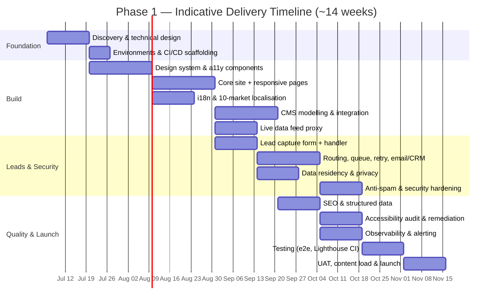

# 2. Delivery Estimate & Timeline — Phase 1 (Responsive Website)

> Estimates are **planning-level (±30%)**, expressed in engineering-days, for a small
> cross-functional team. They cover **Phase 1 (website) only**; Phase 2 (mobile) is
> deliberately out of scope here but the stack is chosen to make it cheaper later.

## 2.1 Scope

In scope for Phase 1:

1. Responsive, accessible (WCAG 2.2 AA) multilingual website across **10 markets**.
2. Headless CMS integration for multilingual content authoring.
3. Live data feed integration (server-side proxy + caching) from a 3rd-party system.
4. Lead capture form + handler: validate, sanitise, store, and route by **lead type +
   country** to email and/or 3rd-party APIs, with durable storage + retry.
5. Data-privacy-compliant, region-aware lead storage.
6. Anti-spam + security controls (WAF, CAPTCHA, rate limiting, CSP, headers).
7. SEO: structured schema.org data, social meta, sitemaps, hreflang; Lighthouse targets.
8. Observability: logging, metrics, tracing, dashboards and alerting.
9. CI/CD, automated tests (unit/integration/e2e + accessibility + Lighthouse CI).

Out of scope (Phase 1): native mobile app, advanced personalisation/AB testing,
analytics warehouse, content migration beyond launch set.

## 2.2 High-level estimate

| #   | Workstream                                                             |   Est. (eng-days) |
| --- | ---------------------------------------------------------------------- | ----------------: |
| 1   | Discovery, technical design, environments, CI/CD scaffolding           |                10 |
| 2   | Design system + accessible component library                           |                15 |
| 3   | Core site build (layouts, navigation, responsive pages)                |                15 |
| 4   | i18n + 10-market localisation framework (routing, hreflang, fallbacks) |                10 |
| 5   | Headless CMS modelling + integration + editor onboarding               |                12 |
| 6   | Live 3rd-party data feed proxy (cache, revalidate, resilience)         |                 8 |
| 7   | Lead capture form + handler (validate/sanitise/store)                  |                 8 |
| 8   | Lead routing, queue, retry/DLQ, email + CRM integrations               |                12 |
| 9   | Data-residency storage + privacy/consent/retention                     |                 8 |
| 10  | Anti-spam + security hardening (WAF, CAPTCHA, CSP, pen-test fixes)     |                 8 |
| 11  | SEO + structured data + social meta + sitemaps                         |                 6 |
| 12  | Accessibility implementation + audit + remediation (WCAG 2.2 AA)       |                 8 |
| 13  | Observability: logging/metrics/tracing/dashboards/alerts               |                 7 |
| 14  | Testing: unit/integration/e2e + Lighthouse CI + a11y automation        |                10 |
| 15  | UAT, content load, launch, hypercare                                   |                 8 |
|     | **Subtotal**                                                           |           **145** |
|     | Project management / QA coordination (~15%)                            |                22 |
|     | Contingency (~15%)                                                     |                25 |
|     | **Total**                                                              | **~192 eng-days** |

At a team of **~5 (2 FE, 1 BE/integrations, 1 design/UX, 0.5 QA, 0.5 PM/TL)** running in
parallel, ~192 eng-days maps to roughly **13–15 calendar weeks** including overlap and
ceremonies.

## 2.3 Timeline

> Source in [`_assets/gantt.mmd`](./_assets/gantt.mmd). Rendered inline:

**Milestones**

- **M1 — Foundations ready** (end wk 3): design system, environments, CI/CD live.
- **M2 — Functional site** (end wk 8): core pages, i18n, CMS, feed integrated in staging.
- **M3 — Leads end-to-end** (end wk 11): capture → store → route with retry, security on.
- **M4 — Launch ready** (end wk 14): WCAG 2.2 AA + Lighthouse targets met, UAT signed off.

## 2.4 Assumptions

1. **Team & availability** as sized above, dedicated for the duration.
2. **One representative market launches first**; remaining 9 follow in waves reusing the
   same framework — translations supplied by the client/agency, not engineered per market.
3. **Translations and content** are provided by the client or a translation vendor;
   engineering builds the localisation framework, not the copy.
4. **3rd-party feed and CRM/email providers** have documented, stable APIs and sandbox
   access available from week 2.
5. **Design direction / brand** is provided or produced in the discovery phase; no
   prolonged brand-identity work.
6. **Legal/privacy guidance** (which data laws apply per market, retention periods,
   consent wording) is available from the client's legal team.
7. **Hosting/cloud accounts and domains** are provisioned by the client early.
8. **Definition of done** includes automated tests, WCAG 2.2 AA, and Lighthouse
   thresholds enforced in CI.
9. Estimates exclude ongoing content production, paid translation costs, and 3rd-party
   SaaS licensing (CMS, WAF, observability) — these are operational, not build, costs.
10. Phase 2 (mobile) is a separate engagement; the stack chosen reduces its cost via a
    shared TypeScript core.
